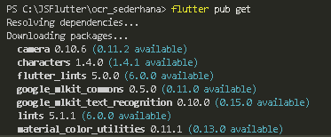
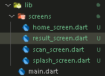
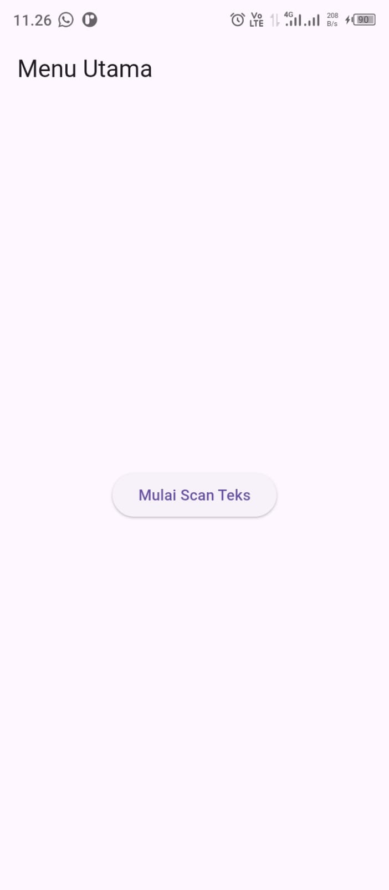
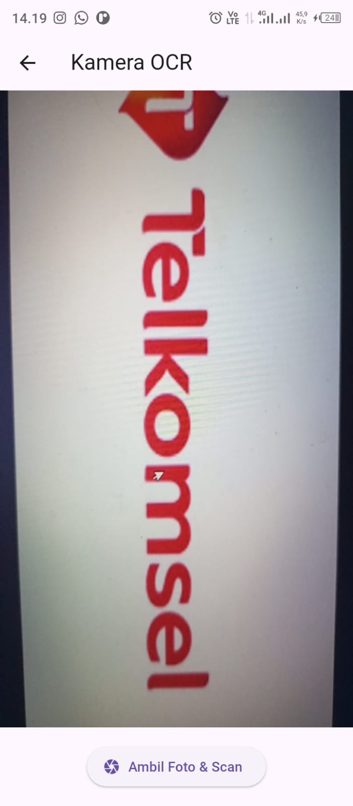

# 📱 Praktikum Flutter — Manajemen Plugin

**Mata Kuliah:** Pemrograman Mobile  
**Nama:** Muhammad Rohman Al Kautsar  
**NIM:** 2341760055  
**Kelas:** SIB 3C  
**No Absen:** 26  

**Repository:** [PMB_JS07 - OCR Sederhana](https://github.com/rohmanalka/ocr_sederhana)  
📄 **[Klik di sini untuk melihat laporan lengkap](https://github.com/rohmanalka/flutter_plugin_pubdev/blob/main/Jobsheet6_26_SIB3C_Muhammad%20Rohman%20Al%20Kautsar.pdf)**  

---

## 📌 Praktikum : Membuat OCR Sederhana

### Langkah 1: Buat Project Baru

Buat sebuah project flutter baru dengan nama ocr_sederhana.

---

### Langkah 2: Menambahkan Plugin

Tambahkan dependensi berikut ke pupspec.yaml

```
dependencies:
  flutter:
    sdk: flutter
  google_mlkit_text_recognition: ^0.11.0
  camera: ^0.10.6
  path_provider: ^2.1.3
  path: ^1.8.3
```
lalu jalankan flutter pub get
  📷 **Screenshot:**  
<p>
  
</p>

---

### Langkah 3: Tambahkan izin kamera

Tambahkan Izin Kamera (Android), Tambahkan di file C:\JSFlutter\ocr_sederhana\android\app\src\main\AndroidManifest.xml sebelum <application>

```dart
<uses-permission android:name = "android.permission.CAMERA" />
```

---

### Langkah 4: Buat struktur folder seperti berikut dan isikan dengan kode

  📷 **Screenshot:**  
<p>
  
</p>

---

---

### 📸 Dokumentasi

  📷 **Screenshot Hasil:**  
<p align="center">
  
  
  
</p>

----

### 📋 Tugas Praktikum & Jawaban

#### a. Apakah semua teks terbaca dengan akurat? Mengapa?

Tidak, tidak semua teks dapat terbaca dengan akurat 100% oleh OCR.  
Meskipun teknologi OCR sudah sangat canggih, tingkat akurasi pengenalannya bervariasi dan dipengaruhi oleh beberapa faktor, yaitu:

1. **Kualitas Gambar Sumber**  
   Gambar atau dokumen dengan resolusi rendah, buram, terlalu terang/gelap (kontras kurang optimal), terdapat noda, atau kondisi fisiknya rusak (kusut, terlipat) akan menurunkan akurasi OCR secara signifikan.

2. **Jenis dan Kualitas Teks**  
   OCR biasanya lebih akurat pada teks cetak yang jelas dengan jenis huruf (font) standar.  
   Akurasi akan menurun pada:
   - Tulisan tangan (walaupun beberapa teknologi OCR canggih/ICR sudah mampu mengatasinya).  
   - Teks dengan font dekoratif atau tidak umum.  
   - Teks yang terlalu kecil atau terlalu padat.

3. **Noise (Gangguan)**  
   Keberadaan *noise* seperti titik-titik acak, latar belakang yang ramai, atau bayangan pada gambar dapat menyebabkan sistem OCR salah mengenali karakter.

---

#### b. Apa kegunaan fitur OCR dalam kehidupan sehari-hari?

1. **Konversi Dokumen Fisik ke Digital**  
   Mengubah surat, buku, kuitansi, faktur, atau dokumen kertas lainnya yang dipindai (scan) atau difoto menjadi teks digital yang dapat disunting (diedit) di aplikasi pengolah kata. Ini mempermudah pengarsipan.

2. **Pencarian Teks (Searchable Text)**  
   Memungkinkan pengguna untuk mencari kata atau frasa tertentu di dalam dokumen berbasis gambar (misalnya, di dalam file PDF yang dipindai).

3. **Ekstraksi Data Cepat**  
   Mengambil informasi spesifik seperti nomor telepon, alamat, atau harga dari kartu nama, papan informasi, atau struk belanja hanya dengan memotretnya.

4. **Digitalisasi Catatan dan Arsip**  
   Mendigitalkan koleksi buku, majalah, atau catatan tulisan tangan/cetak lama sehingga lebih mudah disimpan, dicari, dan dibagikan.

---

#### c. Sebutkan 2 contoh aplikasi nyata yang menggunakan OCR!

1. **Google Lens / Google Foto (Google Search)**  
   - **Kegunaan:** Memungkinkan pengguna untuk mengambil foto teks dari dunia nyata (misalnya, plang nama, menu, atau catatan) dan langsung menyalin teks tersebut ke ponsel, mencarinya di Google, atau menerjemahkannya.

2. **CamScanner (atau aplikasi pemindai dokumen sejenis)**  
   - **Kegunaan:** Digunakan untuk memindai dokumen kertas menggunakan kamera ponsel dan mengubah gambar hasil pindaian (scan) menjadi file PDF yang dapat dicari (*searchable PDF*) atau langsung mengekstrak teks di dalamnya untuk diedit.

---

📚 **Kesimpulan:**  
OCR sangat berguna dalam proses digitalisasi dan efisiensi kerja modern — terutama untuk mengubah dokumen fisik menjadi data digital yang dapat dicari, diolah, dan diintegrasikan dengan sistem informasi lainnya.
