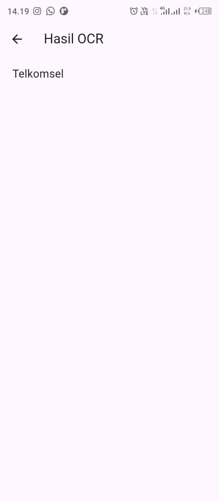

# 📱 Praktikum Flutter — Manajemen Plugin

**Mata Kuliah:** Pemrograman Mobile  
**Nama:** Muhammad Rohman Al Kautsar  
**NIM:** 2341760055  
**Kelas:** SIB 3C  
**No Absen:** 26  

**Repository:** [PMB_JS07 - OCR Sederhana](https://github.com/rohmanalka/ocr_sederhana)  
📄 **[Laporan Lengkap Jobsheet 7](https://github.com/rohmanalka/ocr_sederhana/blob/main/Jobsheet7_26_SIB3C_Muhammad%20Rohman%20Al%20Kautsar.pdf)**  
📄 **[Laporan Lengkap UTS](https://github.com/rohmanalka/ocr_sederhana/blob/main/UTSPMB_26_SIB3C_Muhammad%20Rohman%20Al%20Kautsar.pdf)**  

---

## 📌 Praktikum : Membuat OCR Sederhana

### Langkah 1: Buat Project Baru

Buat sebuah project flutter baru dengan nama ocr_sederhana.

---

### Langkah 2: Menambahkan Plugin

Tambahkan dependensi berikut ke pupspec.yaml

```
dependencies:
  flutter:
    sdk: flutter
  google_mlkit_text_recognition: ^0.11.0
  camera: ^0.10.6
  path_provider: ^2.1.3
  path: ^1.8.3
```
lalu jalankan flutter pub get
  📷 **Screenshot:**  
<p>
  
</p>

---

### Langkah 3: Tambahkan izin kamera

Tambahkan Izin Kamera (Android), Tambahkan di file C:\JSFlutter\ocr_sederhana\android\app\src\main\AndroidManifest.xml sebelum <application>

```dart
<uses-permission android:name = "android.permission.CAMERA" />
```

---

### Langkah 4: Buat struktur folder seperti berikut dan isikan dengan kode

  📷 **Screenshot:**  
<p>
  
</p>

---

---

### 📸 Dokumentasi

   📷 **Screenshot Hasil:**  
<p align="center">
  
  
  
</p>

----

### 📋 Tugas Praktikum & Jawaban

#### a. Apakah semua teks terbaca dengan akurat? Mengapa?

Tidak, tidak semua teks dapat terbaca dengan akurat 100% oleh OCR.  
Meskipun teknologi OCR sudah sangat canggih, tingkat akurasi pengenalannya bervariasi dan dipengaruhi oleh beberapa faktor, yaitu:

1. **Kualitas Gambar Sumber**  
   Gambar atau dokumen dengan resolusi rendah, buram, terlalu terang/gelap (kontras kurang optimal), terdapat noda, atau kondisi fisiknya rusak (kusut, terlipat) akan menurunkan akurasi OCR secara signifikan.

2. **Jenis dan Kualitas Teks**  
   OCR biasanya lebih akurat pada teks cetak yang jelas dengan jenis huruf (font) standar.  
   Akurasi akan menurun pada:
   - Tulisan tangan (walaupun beberapa teknologi OCR canggih/ICR sudah mampu mengatasinya).  
   - Teks dengan font dekoratif atau tidak umum.  
   - Teks yang terlalu kecil atau terlalu padat.

3. **Noise (Gangguan)**  
   Keberadaan *noise* seperti titik-titik acak, latar belakang yang ramai, atau bayangan pada gambar dapat menyebabkan sistem OCR salah mengenali karakter.

---

#### b. Apa kegunaan fitur OCR dalam kehidupan sehari-hari?

1. **Konversi Dokumen Fisik ke Digital**  
   Mengubah surat, buku, kuitansi, faktur, atau dokumen kertas lainnya yang dipindai (scan) atau difoto menjadi teks digital yang dapat disunting (diedit) di aplikasi pengolah kata. Ini mempermudah pengarsipan.

2. **Pencarian Teks (Searchable Text)**  
   Memungkinkan pengguna untuk mencari kata atau frasa tertentu di dalam dokumen berbasis gambar (misalnya, di dalam file PDF yang dipindai).

3. **Ekstraksi Data Cepat**  
   Mengambil informasi spesifik seperti nomor telepon, alamat, atau harga dari kartu nama, papan informasi, atau struk belanja hanya dengan memotretnya.

4. **Digitalisasi Catatan dan Arsip**  
   Mendigitalkan koleksi buku, majalah, atau catatan tulisan tangan/cetak lama sehingga lebih mudah disimpan, dicari, dan dibagikan.

---

#### c. Sebutkan 2 contoh aplikasi nyata yang menggunakan OCR!

1. **Google Lens / Google Foto (Google Search)**  
   - **Kegunaan:** Memungkinkan pengguna untuk mengambil foto teks dari dunia nyata (misalnya, plang nama, menu, atau catatan) dan langsung menyalin teks tersebut ke ponsel, mencarinya di Google, atau menerjemahkannya.

2. **CamScanner (atau aplikasi pemindai dokumen sejenis)**  
   - **Kegunaan:** Digunakan untuk memindai dokumen kertas menggunakan kamera ponsel dan mengubah gambar hasil pindaian (scan) menjadi file PDF yang dapat dicari (*searchable PDF*) atau langsung mengekstrak teks di dalamnya untuk diedit.

---

📚 **Kesimpulan:**  
OCR sangat berguna dalam proses digitalisasi dan efisiensi kerja modern — terutama untuk mengubah dokumen fisik menjadi data digital yang dapat dicari, diolah, dan diintegrasikan dengan sistem informasi lainnya.

----

## UTS : Modifikasi ocr_sederhana  

### Soal 1 : Modifikasi Struktur Navigasi dan Aliran

&emsp;Tujuan: Menyederhanakan alur navigasi dan meningkatkan pengalaman pengguna di
HomeScreen.

#### 1. Pengubahan Navigasi Home

&emsp;a. Ubah ElevatedButton di HomeScreen (lib/screens/home_screen.dart) menjadi *widget* **ListTile**.  
&emsp;b. Atur ListTile: leading: Icon(Icons.camera_alt, color: Colors.blue); title: Text (’Mulai Pindai Teks Baru’).  
&emsp;c. Fungsi onTap harus menggunakan Navigator.push() untuk ke ScanScreen.

```dart
body: ListView(
         children: [
            ListTile(
               leading: const Icon(Icons.camera_alt, color: Colors.blue),
               title: const Text('Mulai Pindai Teks Baru'),
               onTap: () {
                  Navigator.push(
                     context,
                     MaterialPageRoute(builder: (_) => const ScanScreen()),
                  );
               },
            ),
         ],
      ),

```

----

#### 2. Teks Utuh dan Navigasi Balik

&emsp;a. Di ResultScreen (lib/screens/result_screen.dart), hapus fungsi ocrText replaceAllagar hasil teks ditampilkan dengan baris baru (\n) yang utuh.  
&emsp;b. Tambahkan FloatingActionButton dengan ikon Icons.home.  
&emsp;c. Ketika tombol ditekan, navigasi harus kembali langsung ke HomeScreen menggunakan **Navigator.pushAndRemoveUntil()** (atau metode yang setara) untuk menghapus semua halaman di atasnya dari stack navigasi.

```dart
child: SelectableText(
         ocrText.isEmpty ? 'Tidak ada teks ditemukan.' : ocrText,
         style: const TextStyle(fontSize: 18),
      ),

```

```dart
floatingActionButton: FloatingActionButton(
                        child: const Icon(Icons.home),
                        onPressed: () {
                           Navigator.pushAndRemoveUntil(
                              context,
                              MaterialPageRoute(builder: (_) => const HomeScreen()),
                              (route) => false,
                           );
                        },
                     ),

```

   📷 **Screenshot Hasil:**  
<p align="center">
  
  
  
</p>

----

### Soal 2 : Penyesuaian Tampilan dan Penanganan State/Error

&emsp;Tujuan: Memperbaiki tampilan *loading* dan memberikan *feedback* error yang lebih
jelas.

#### 1. Custom Loading Screen di ScanScreen

&emsp;a. Di ScanScreen (lib/screens/scan_screen.dart), modifikasi tampilan *loading* yang muncul sebelum kamera siap (if (!controller.value.isInitialized)) :  
&emsp;b. Latar Belakang: Scaffold(backgroundColor: Colors.grey[900]).  
&emsp;c. Isi: Di dalam Center, tampilkan Column berisi CircularProgressIndicator(coloColors.yellow).  
&emsp;d. Di bawah indikator, tambahkan Text(’Memuat Kamera... Harap tunggu.’, style: TextStyle(color: Colors.white, fontSize: 18)).

```dart
if (_controller == null || !_controller!.value.isInitialized) {
   return Scaffold(
      backgroundColor: Colors.grey[900],
      body: Center(
         child: Column(
            mainAxisSize: MainAxisSize.min,
            children: const [
               CircularProgressIndicator(color: Colors.yellow),
               SizedBox(height: 16),
               Text(
                  'Memuat Kamera... Harap tunggu.',
                  style: TextStyle(color: Colors.white, fontSize: 18),
               ),
            ],
         ),
      )
   );
}

```

----

#### 2. pesifikasi Pesan Error

&emsp;a. Di fungsi _takePicture() pada ScanScreen, modifikasi blok catch (e) untuk mengubah pesan *error* pada SnackBar.  
&emsp;b. Pesan SnackBar harus berbunyi: "Pemindaian Gagal! Periksa Izin Kamera atau coba lagi." (Hilangkan variabel *error* ($e)).

```dart
catch (e) {
   if (!mounted) return;
   ScaffoldMessenger.of(context).showSnackBar(
      SnackBar(content: Text('Pemindaian Gagal! Periksa Izin Kamera atau coba lagi.')),
   );
}

```

test error : ubah path file kamera yang tidak valid pada kode

```dart
final ocrText = await _ocrFromFile(File(image.path));

```
menjadi

```dart
final ocrText = await _ocrFromFile(File('path_tidak_valid.jpg'));

```

   📷 **Screenshot Hasil:**  
<p align="center">
  
  
</p>

----

### Soal 3 :  Implementasi Plugin Text-to-Speech (TTS)

&emsp;Tujuan: Mengintegrasikan fitur membaca teks secara lisan menggunakan *plugin* flutter_tts.

#### 1. Instalasi Plugin

&emsp;a. Tambahkan *plugin* flutter_tts ke dalam file pubspec.yaml (gunakan versi terbaru yang kompatibel).  
&emsp;b. Jalankan flutter pub get

```dart
dependencies:
  flutter:
    sdk: flutter
  google_mlkit_text_recognition: ^0.11.0
  camera: ^0.10.6
  path_provider: ^2.1.3
  path: ^1.8.3
  flutter_tts: ^4.0.2

```

----

#### 2. Konversi Widget dan Inisialisasi

&emsp;a. Ubah ResultScreen dari StatelessWidget menjadi **StatefulWidget**.  
&emsp;b. Di initState(), inisialisasi FlutterTts dan atur bahasa pembacaan menjadi Bahasa Indonesia.  
&emsp;c. Implementasikan dispose() untuk menghentikan mesin TTS saat halaman ditutup.  

```dart
import 'package:flutter_tts/flutter_tts.dart';

```

```dart
class ResultScreen extends StatefulWidget {
  final String ocrText;

  const ResultScreen({super.key, required this.ocrText});

  @override
  State<ResultScreen> createState() => _ResultScreenState();
}

class _ResultScreenState extends State<ResultScreen> {
  late FlutterTts flutterTts;

  @override
  void initState() {
    super.initState();
    flutterTts = FlutterTts();
    flutterTts.setLanguage("id-ID");
  }

  @override
  void dispose() {
    flutterTts.stop();
    super.dispose();
  }

  @override
  Widget build(BuildContext context) {
    return Scaffold(
      appBar: AppBar(title: const Text('Hasil OCR')),
      body: Padding(
        padding: const EdgeInsets.all(16.0),
        child: SingleChildScrollView(
          child: SelectableText(
            widget.ocrText.isEmpty ? 'Tidak ada teks ditemukan.' : widget.ocrText,
            style: const TextStyle(fontSize: 18),
          ),
        ),
      ),
      floatingActionButton: FloatingActionButton(
        child: const Icon(Icons.home),
        onPressed: () {
          Navigator.pushAndRemoveUntil(
            context,
            MaterialPageRoute(builder: (_) => const HomeScreen()),
            (route) => false,
          );
        },
      ),
    );
  }
}

```

----

#### 3. Fungsionalitas Pembacaan

&emsp;a. Tambahkan FloatingActionButton kedua di ResultScreen (atau ganti AppBar dengan action button) dengan ikon Icons.volume_up.  
&emsp;b. Ketika tombol ditekan, panggil fungsi speak() pada FlutterTts untuk membacakan seluruh isi ocrText.

```dart
Future<void> speak() async {
    if (widget.ocrText.isNotEmpty) {
      await flutterTts.speak(widget.ocrText);
    }
  }

  @override
  Widget build(BuildContext context) {
    return Scaffold(
      appBar: AppBar(
        title: const Text('Hasil OCR'),
        actions: [
          IconButton(
            icon: const Icon(Icons.volume_up),
            tooltip: 'Bacakan teks',
            onPressed: speak,
          ),
        ],
      ),

```

   📷 **Screenshot Hasil:**  
<p align="center">
  
</p>